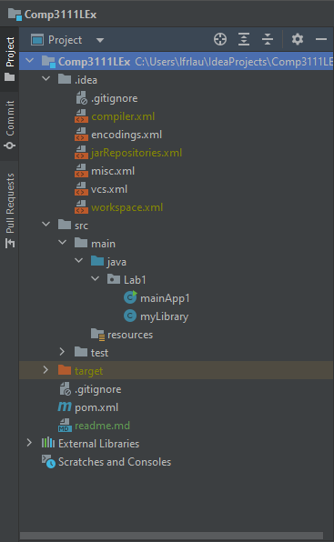
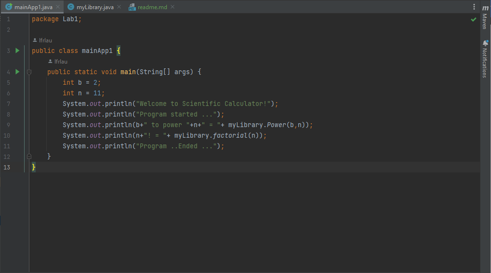
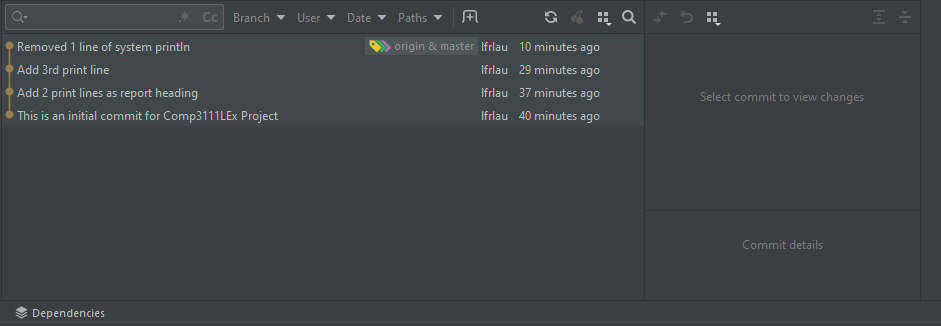

This is my 1st lab in Comp3111 Software Engineering.

    1. I have learnt the way to build a Java Project in Intellij;
    2. I have successfully created my first GitHub to share projectsource with others;

Here's the screenshot of my 1st lab project in Intellij;

